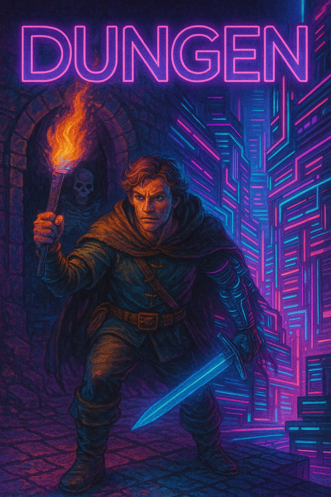

# DUNGEN!

A generative zork-like dungeon explorer that dynamically creates a world of mystery, peril, and unexpected discoveries. As you descend deeper into LLM generated labyrinths, your choices will shape the story, the dangers you face, and the secrets you uncover.

Uses a combination of LatitudeGames/Wayfarer-12B (Narrative) and OpenAI (Assistant).

## SETUP!

Create an environment...

Set `OPENAI_API_KEY` env variable.

Set `HUGGINGFACE_API_KEY` env variable.

cd `dungen`

`pip install .`

## USAGE!

Use one of the demo settings files, `fantasy.yaml` or `cyberpunk.yaml`, or copy one and define your own theme and/or character.

`dungen --settings file.yaml`

This will run the Wayfarer-12B model on your local device. Works, but slow on a 3090.

Passing `--vllm` will run the Wayfarer-12B model on RunPod using a serverless vLLM endpoint.

This assumes you are familair with RunPod and setting a serverless endpoint.

Set `REQUEST_KEY` env variable. This is your RunPod API Key.

Update the `endpoint_id` in the `config.yaml` file. This is your RunPod endpoint id.

`dungen --settings file.yaml --vllm`

## WEBUI!

`cd dungen/dungen/webui/`

`npm install` *Assumes node set up...

`python server.py`

Visit `http://127.0.0.1:5000/`
